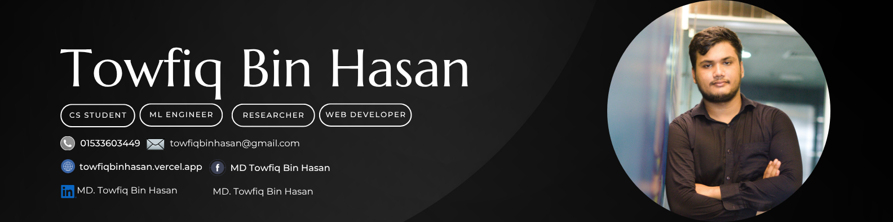



 

  

  

 

## 👋 About Me

I am a meticulous **Computer Science and Engineering** student at **AIUB**, majoring in **Data Science**. I have a strong passion for my field, particularly in **Machine Learning**, **Data Mining**, and **Research**. My technical expertise includes **C++, Java, C#**, and **full-stack web development**, along with a solid understanding of **DSA** and **database management**. I have also participated in several academic conferences and have shared my projects on GitHub.

Beyond my technical life, I am an adventurous traveler. I have a dream of going on a world tour, and I have already successfully traveled across all of Bangladesh with my travel group, **TH Team**. My experience as a traveler has made me a more adaptable and fast learner. With a mix of strong analytical skills, teaching experience, and a motivated mindset, I am eager to bring my technical knowledge into a professional environment.

- 🌐 Portfolio: **[towfiqbinhasan.vercel.app](https://towfiqbinhasan.com)**
- 📫 Email: **towfiqbinhasan@gmail.com**
- 🐙 GitHub: **[github.com/towfiqbinhasan](https://github.com/towfiqbinhasan)**

 

## 💻 Programming Languages

<table>
<tr>
<td width="33%">

**Full-Stack Web Development**
From a Class 12 curiosity about HTML to shipping full MERN-stack projects.
`HTML5` `CSS3` `JavaScript (ES6+)` `React` `Node.js`

</td>
<td width="33%">

**Python**
From simple curiosity in freshman year to the primary tool driving my AI research.
`Python` `AI` `Data Science`

</td>
<td width="33%">

**R Language**
Stepping out of my Python comfort zone to become a data science powerhouse in R.
`R` `ggplot2` `Tidyverse`

</td>
</tr>
<tr>
<td width="33%">

**C#**
Conquering one of my toughest courses (OOP2) by building a real Pharmacy Management System.
`C#` `OOP` `Database Integration`

</td>
<td width="33%">

**Java**
From basic YouTube tutorials to building a Movie Ticket Management System.
`Java`

</td>
<td width="33%">

**C++**
How C++ turned my fear of programming into my greatest strength.
`SQL` `Database Design`

</td>
</tr>
</table>

 

## 🛠️ Tools & Software

<table>
<tr>
<td width="33%">

**Visual Studio Code**
My daily-driver code editor since 2020 — versatile, customizable, and irreplaceable.

</td>
<td width="33%">

**Code::Blocks**
The IDE where I typed my very first "Hello World!" and fell in love with C++.

</td>
<td width="33%">

**Google Colab**
My secret weapon for AI research — free GPUs and cloud access from anywhere.

</td>
</tr>
<tr>
<td width="33%">

**PyCharm**
The professional IDE that made learning Python IDE-driven and structured.

</td>
<td width="33%">

**Microsoft Visual Studio**
The backbone of my first big C# project — full OOP & database integration.

</td>
<td width="33%">

**Oracle for Database**
Turning simple SQL commands into full database design solutions.

</td>
</tr>
<tr>
<td width="33%">

**AutoCAD**
Discovering that AutoCAD's real power, for me, was designing precise electrical circuits.

</td>
<td width="33%">

**Notepad++**
Learning Java's true structure by coding without a heavy IDE.

</td>
<td width="33%">

**RStudio**
The IDE that made statistical analysis and visualization click for my Data Science course.

</td>
</tr>
<tr>
<td width="33%">

**GitHub**
My daily habit since Data Structures — part portfolio, part safety net.

</td>
<td width="33%">

**Adobe Tools**
Since 2019, transforming raw clips and plain photos into something beautiful.

</td>
<td width="33%">

**Microsoft Office Suite**
A lifelong companion — from childhood curiosity to daily professional tool.

</td>
</tr>
<tr>
<td width="33%">

**CapCut**
My go-to for fast, simple travel-short editing with the TH Team.

</td>
<td width="33%">

**Icecream Video Editor**
Six years running — my simple, reliable go-to since 2020.

</td>
<td width="33%">

**Filmmaking & Adobe Video Editor**
Capturing the soul of every journey for the TH Team's travel content.

</td>
</tr>
<tr>
<td width="33%">

**Overleaf**
My go-to for writing clean, professional research papers in LaTeX.

</td>
<td width="33%"></td>
<td width="33%"></td>
</tr>
</table>

 

## 📊 GitHub Stats

 

## 🐍 Contribution Graph

 

## 🤝 Connect With Me

 

 

<i>Thanks for visiting my profile — feel free to explore my repositories! ⭐</i>

